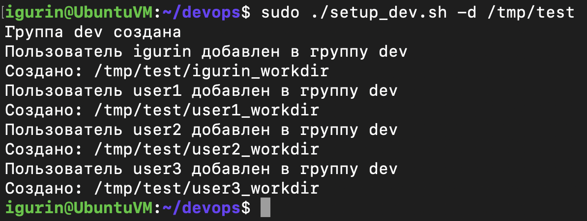
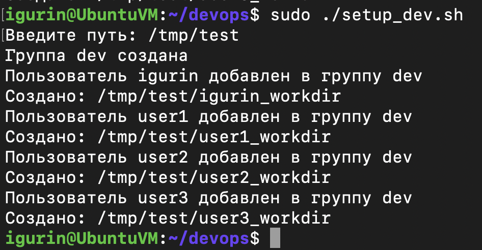
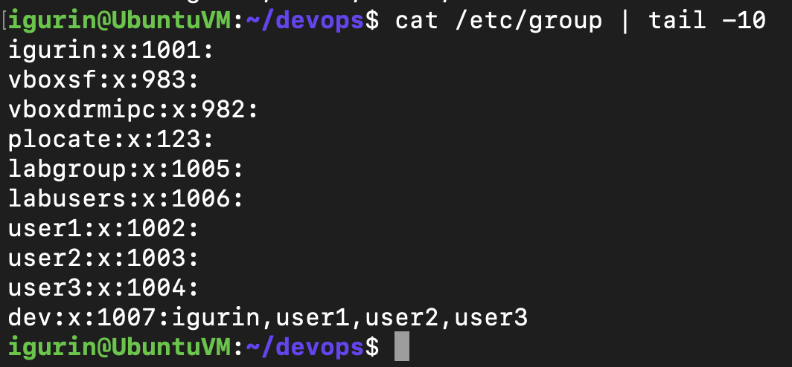
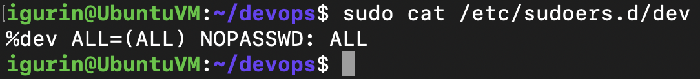
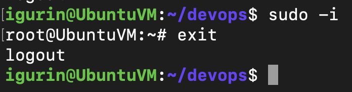
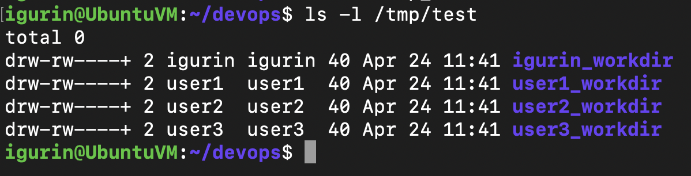
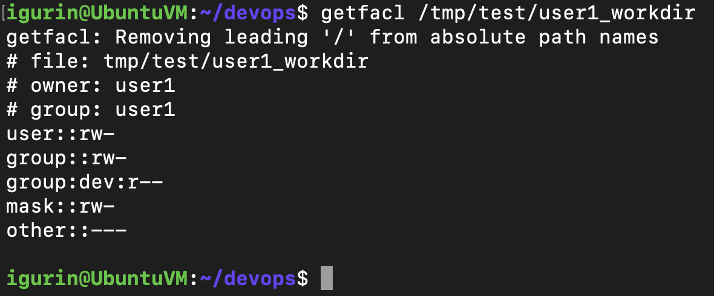
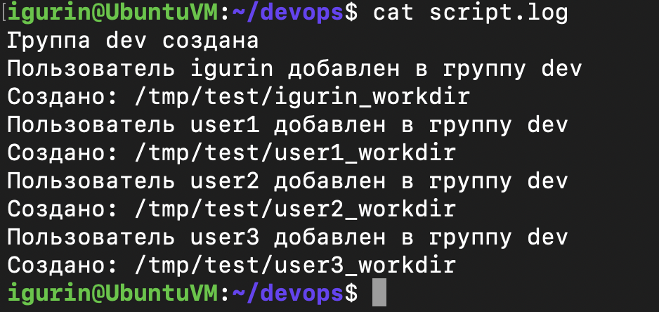

# Bash Script

## Описание

Скрипт выполняет следующие действия:

* Создает группу `dev`
* Добавляет в неё всех пользователей с UID >= 1000
* Выдаёт группе `dev` права sudo без запроса пароля
* Создает директории по маске `<username>_workdir`
* Путь до директорий задается через ключ `-d` или вводится вручную
* Устанавливает права `660` на директории
* Выдаёт группе `dev` права на чтение через ACL
* Ведёт лог в stdout и файл `script.log`

---

## Запуск

Перед запуском нужно выдать скрипту права на выполнение:

```bash
chmod +x setup_dev.sh
```

Запуск с ключом `-d`, где сразу передается путь для рабочих директорий:

```bash
sudo ./setup_dev.sh -d /tmp/test
```



Запуск без ключа: путь вводится вручную после приглашения `Введите путь:`.

```bash
sudo ./setup_dev.sh
```



---

## Проверка

### Группа dev

```bash
cat /etc/group | tail -10
```

В конце списка должна появиться группа `dev`, а также пользователи, добавленные в неё.



### Sudo без пароля

Скрипт создает правило в `/etc/sudoers.d/dev`, которое разрешает участникам группы `dev` выполнять команды через `sudo` без ввода пароля:

```bash
sudo cat /etc/sudoers.d/dev
```



Проверить работу `sudo` можно входом в root-сессию:

```bash
sudo -i
```



### Созданные директории

```bash
ls -l /tmp/test
```

Для каждого пользователя создается отдельная директория по маске `<username>_workdir`.



### ACL для группы dev

```bash
getfacl /tmp/test/user1_workdir
```

В выводе должна быть строка с правом чтения для группы `dev`:

```
group:dev:r--
```



### Лог файл

```bash
cat script.log
```

В лог записываются сообщения о создании группы, добавлении пользователей и создании рабочих директорий.


