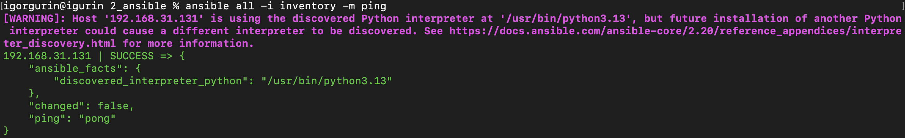
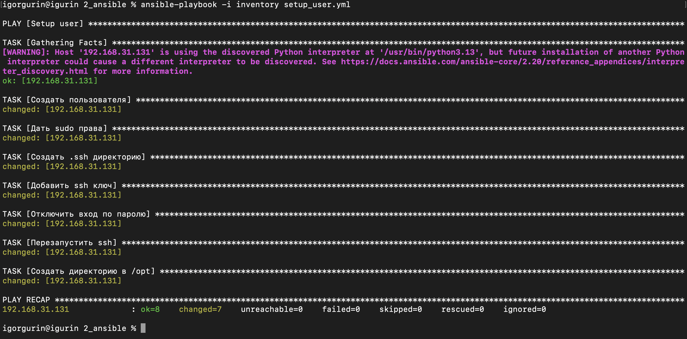
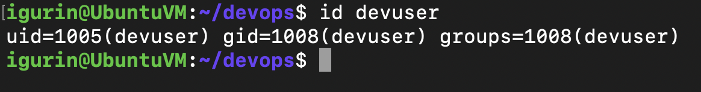
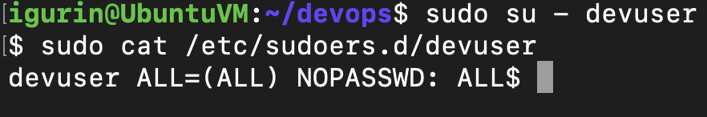
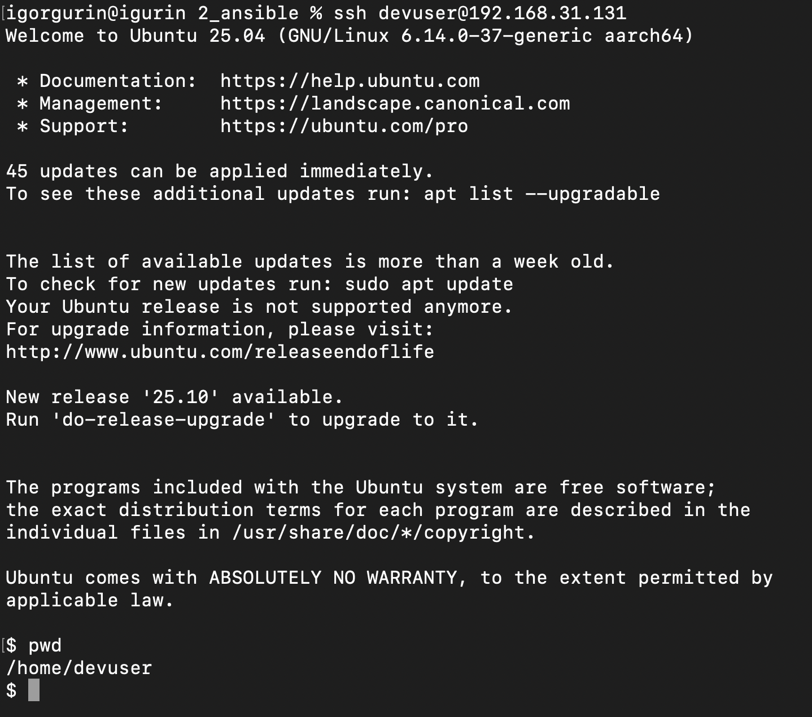
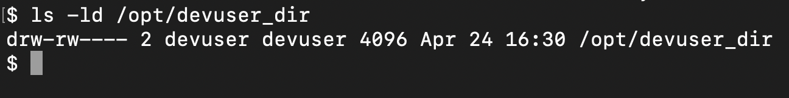

# Ansible: настройка пользователя на удаленной машине

## Описание задания

Ansible playbook выполняет следующие действия на удаленной ubuntu vm:

- создает пользователя `devuser`;
- выдает пользователю права `sudo` без запроса пароля;
- настраивает SSH-авторизацию по публичному ключу;
- отключает SSH-авторизацию по паролю;
- создает директорию `/opt/devuser_dir` с владельцем `devuser` и правами `660`.

Основной playbook находится в файле [`setup_user.yml`](setup_user.yml), inventory - в файле [`inventory`](inventory).

## Подготовка

Перед запуском убедился, что мой хост видит удаленный сервер из inventory:

```bash
ansible all -i inventory -m ping
```



## Запуск playbook

Playbook запускается командой:

```bash
ansible-playbook -i inventory setup_user.yml
```

После выполнения все задачи завершились успешно.



## Проверка результата

### Пользователь создан

Проверка пользователя выполнялась командой:

```bash
id devuser
```

Команда показывает, что пользователь `devuser` существует на удаленной vm.



### Sudo-права выданы

Для пользователя создан файл `/etc/sudoers.d/devuser`, который разрешает выполнение команд через `sudo` без ввода пароля:

```bash
sudo cat /etc/sudoers.d/devuser
```



### SSH-авторизация по ключу работает

Подключение к серверу выполнялось под пользователем `devuser`:

```bash
ssh devuser@192.168.31.131
```

Вход выполнен без запроса пароля, после подключения домашняя директория пользователя - `/home/devuser`.



### Директория в /opt создана

Проверка прав и владельца директории:

```bash
ls -ld /opt/devuser_dir
```


