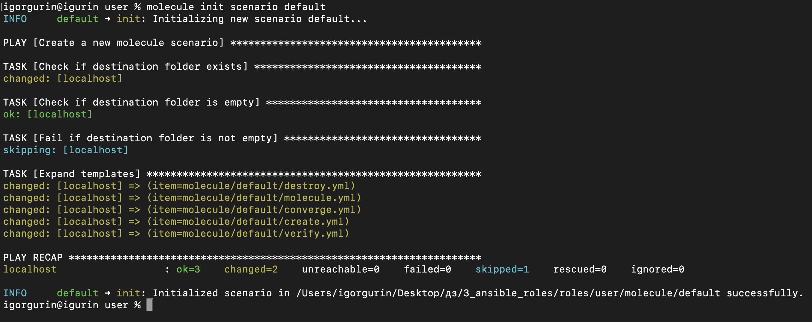
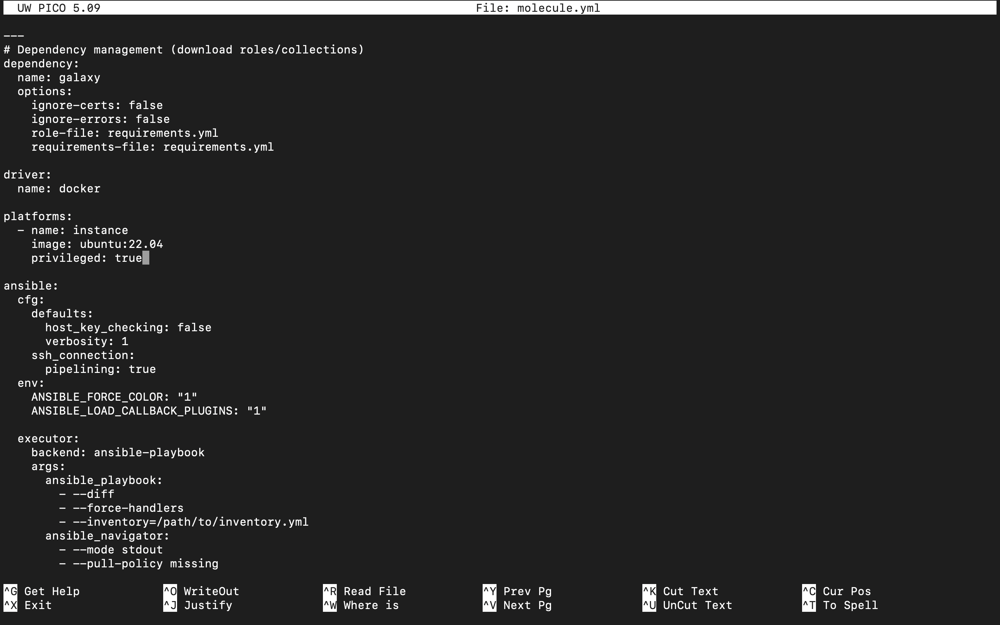
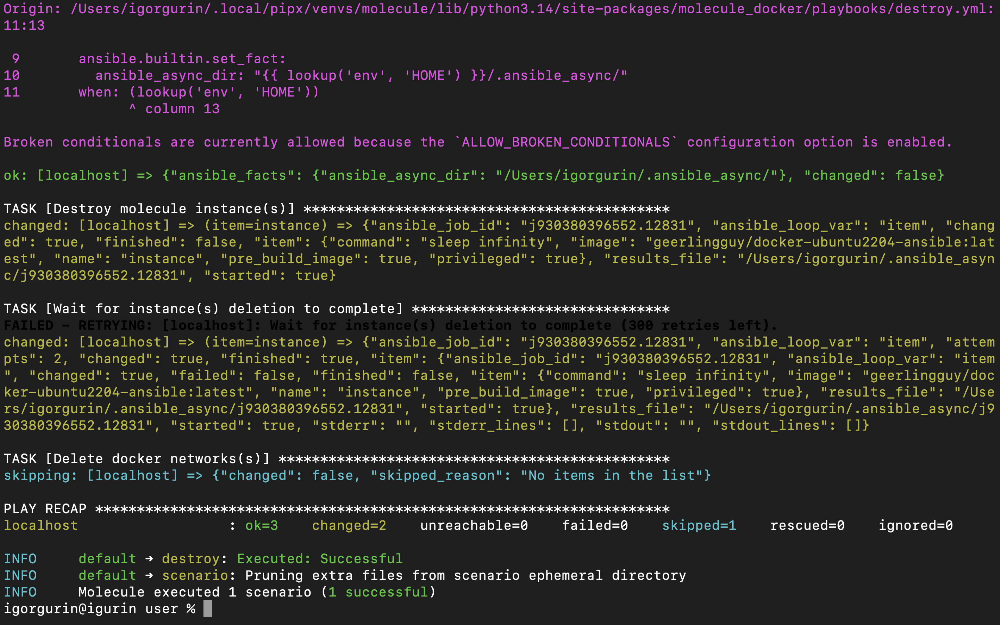
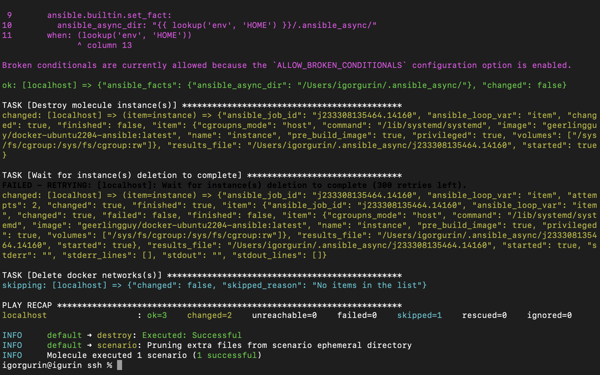

# Ansible Roles

Задание выполнено с использованием Ansible roles и Molecule.

## Что реализовано

В проекте есть общий playbook `playbook.yml`, который подключает две роли:

```yaml
roles:
  - user
  - ssh
```

Роль `user` отвечает за настройку пользователей:

- создает пользователей на удаленной машине;
- выдает пользователям sudo-права через `/etc/sudoers.d/`;
- добавляет открытые SSH-ключи в `authorized_keys`;
- создает для каждого пользователя директорию в `/opt/` с правами `0660`.

Роль `ssh` отвечает за настройку SSH:

- отключает авторизацию по паролю;
- оставляет авторизацию по SSH-ключам;
- перезапускает SSH-сервис после изменения конфигурации.

Пользователи и их открытые ключи задаются через переменные в `roles/user/vars/main.yml`.

## Тестирование через Molecule

Для каждой роли подготовлен отдельный сценарий Molecule. В качестве driver/provider используется Docker, поэтому тесты запускаются в контейнере и не меняют основную систему.

Пример запуска проверки роли `user`:

```bash
cd roles/user
molecule test
```

Пример запуска проверки роли `ssh`:

```bash
cd roles/ssh
molecule test
```

Во время теста Molecule выполняет стандартную последовательность: dependency, destroy, syntax, create, converge, idempotence, verify и destroy.

## Скриншоты

### Инициализация Molecule

На скриншоте показан этап подготовки Molecule-сценария для роли.



### Использование Docker driver/provider

В конфигурации Molecule выбран Docker-драйвер. Контейнер используется как тестовая удаленная машина для применения роли.



### Тестирование роли user

Скриншот подтверждает запуск и успешное прохождение Molecule-теста для роли `user`, которая создает пользователей, настраивает sudo, SSH-ключи и директории в `/opt/`.



### Тестирование роли ssh

Скриншот подтверждает запуск и успешное прохождение Molecule-теста для роли `ssh`, которая отключает парольную авторизацию в SSH.

