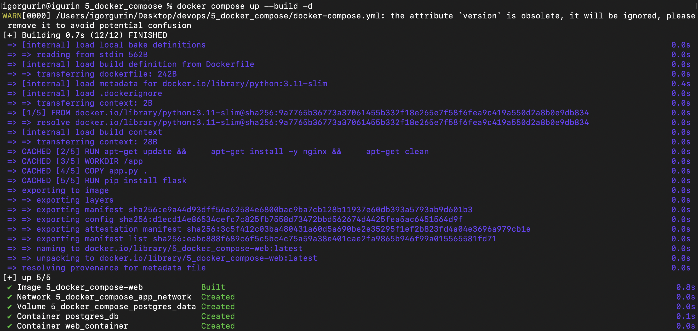
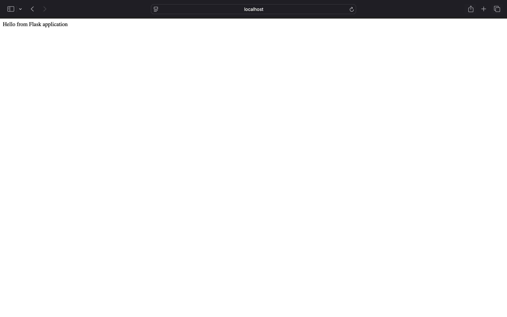
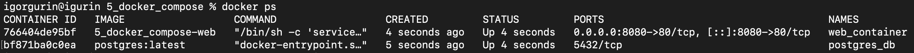
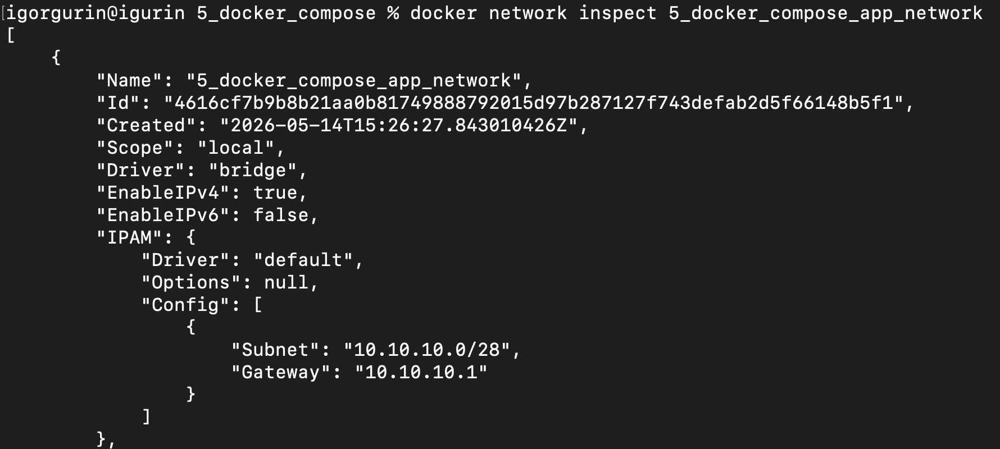

# Docker Compose

## Описание

Был создан docker-compose конфиг для запуска двух контейнеров:

* nginx + Flask приложение
* PostgreSQL

Контейнеры работают в одной bridge сети с подсетью:

```text
10.10.10.0/28
```

---

## Что реализовано

* nginx доступен с хостовой машины на порту `8080`
* Flask приложение работает внутри web контейнера
* PostgreSQL запускается в отдельном контейнере
* для PostgreSQL используется docker volume
* nginx конфиг передается через volume
* для сервисов задан порядок запуска через `depends_on`
* база данных доступна по именам:

  * `new_db`
  * `dev_db`

---

## Запуск

```bash
docker compose up --build -d
```

На скриншоте показано, что Docker Compose собрал образ web-приложения, создал сеть, volume и запустил контейнеры.



---

## Проверка

Открыть в браузере:

```text
http://localhost:8080
```

После запуска отображается сообщение Flask приложения.



---

## Проверка контейнеров

```bash
docker ps
```

На скриншоте видно, что запущены контейнеры `web_container` и `postgres_db`, а порт `8080` хостовой машины проброшен на порт `80` web-контейнера.



---

## Проверка сети

```bash
docker network inspect 5_docker_compose_app_network
```

На скриншоте показана созданная bridge-сеть `5_docker_compose_app_network` с подсетью `10.10.10.0/28`.


